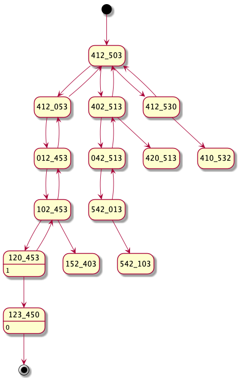

# Table of Contents

1.  [Sliding Puzzle](#org454b570)
    1.  [Problem Statement](#orgc5c6e13)
    2.  [Glossary](#orgb343c4a)
    3.  [Thinking it Through](#org6fbc94d)
    4.  [Utilities](#orgf74f556)
        1.  [`value_at_location`](#orga75b782)
        2.  [`swap` -](#org12c4028)
    5.  [Putting it Together](#orgc5120fe)
    6.  [Tests](#orgcfa936f)
    7.  [Links](#org7d60615)

# Sliding Puzzle

## Problem Statement

[From the Operation Spark #daily-programmer chat](https://operation-code.slack.com/archives/C7JMZ5LAV/p1571739463040000)

> On a 2x3 board, there are 5 tiles represented by the integers 1 through 5, and an empty square represented by 0.
> A move consists of choosing 0 and a 4-directionally adjacent number and swapping it.
> The state of the board is solved if and only if the board is `[[1,2,3],[4,5,0]]`.
> Given a puzzle board, return the least number of moves required so that the state of the board is solved. If it is impossible for the state of the board to be solved, return -1.
> 
> Note:
> 
> -   board will be a 2 x 3 array as described above
> -   `board[i][j]` will be a permutation of `[0, 1, 2, 3, 4, 5]`

<table id="org03b7875" border="2" cellspacing="0" cellpadding="6" rules="groups" frame="hsides">

<colgroup>
<col  class="org-right" />

<col  class="org-right" />

<col  class="org-right" />
</colgroup>
<tbody>
<tr>
<td class="org-right">1</td>
<td class="org-right">2</td>
<td class="org-right">3</td>
</tr>

<tr>
<td class="org-right">4</td>
<td class="org-right">0</td>
<td class="org-right">5</td>
</tr>
</tbody>
</table>

Expected Output: 1
Explanation: Swap the 0 and the 5 in one move.

<table id="org4942b83" border="2" cellspacing="0" cellpadding="6" rules="groups" frame="hsides">

<colgroup>
<col  class="org-right" />

<col  class="org-right" />

<col  class="org-right" />
</colgroup>
<tbody>
<tr>
<td class="org-right">1</td>
<td class="org-right">2</td>
<td class="org-right">3</td>
</tr>

<tr>
<td class="org-right">5</td>
<td class="org-right">4</td>
<td class="org-right">0</td>
</tr>
</tbody>
</table>

Output: -1
Explanation: No number of moves will make the board solved.

<table id="org40e254a" border="2" cellspacing="0" cellpadding="6" rules="groups" frame="hsides">

<colgroup>
<col  class="org-right" />

<col  class="org-right" />

<col  class="org-right" />
</colgroup>
<tbody>
<tr>
<td class="org-right">4</td>
<td class="org-right">1</td>
<td class="org-right">2</td>
</tr>

<tr>
<td class="org-right">5</td>
<td class="org-right">0</td>
<td class="org-right">3</td>
</tr>
</tbody>
</table>

Expected Output: 5
Explanation: 5 is the smallest number of moves that solves the board.
An example path:

-   After move 0: [[4,1,2],[5,0,3]]
-   After move 1: [[4,1,2],[0,5,3]]
-   After move 2: [[0,1,2],[4,5,3]]
-   After move 3: [[1,0,2],[4,5,3]]
-   After move 4: [[1,2,0],[4,5,3]]
-   After move 5: [[1,2,3],[4,5,0]]

<table id="org53a9819" border="2" cellspacing="0" cellpadding="6" rules="groups" frame="hsides">

<colgroup>
<col  class="org-right" />

<col  class="org-right" />

<col  class="org-right" />
</colgroup>
<tbody>
<tr>
<td class="org-right">3</td>
<td class="org-right">2</td>
<td class="org-right">4</td>
</tr>

<tr>
<td class="org-right">1</td>
<td class="org-right">5</td>
<td class="org-right">0</td>
</tr>
</tbody>
</table>

Expected Output: 14

## Glossary

We're going to be using the following terms here

-   **state** - a 2D state of the board at a given point in time. Since we're moving things around, solving this puzzle can be considered a sequence of states.
-   **location** - a two value tuple representing a location in a **state** `(row, column)`. Might nto be a valid location
-   **value** - the actual value in a state at a location

## Thinking it Through

Ok, so lets start here by defining the high level thing we want as if our helper methods allready existed. There is an obvious case for recursion here as I'm picturing execution as a tree (the diagram below is a partial illustration of `sp-board-3`)

The rules for the recursion therefore seem to be

-   A list of known states is a map from a state to the minimum moves from that state. It is seeded with the desired state and a step count of 0
-   Given a new state, if we have seen it before, return the number of moves associated
-   Otherwise, for each possible move recurse, take the minimum  non-null and add 1. That is the thic cell's value and you return it

An optimization is possible here. If we do the search depth first then once we know the amount of moves one branch takes, we could pass a "moves left" field down to other branches (decremented by 1 on each pass).

So I'm thinking something like this at the high level

    def _get_solve_depth(known_states, state, move_left):
        if state in known_states:
            if None != (steps := known_states.get(state)):
                yield (steps, state)
                return
            return
        if move_left == 0:
            return
        for (next_steps, next_state) in get_states_by_moving_0(state, move_left-1):
            yield (1+next_steps, next_state)
    
    
    
    def get_solve_depth(known_states, state, moves_left):
        known_states = {((1,2,3),(4,5,0)): 0}
        return _get_solve_depth(known_states, ((1,3,0),(4,2,5)), None)

Hmm, that's not right, when would `known_states` get mutated?

And I worry about some of the paths being really deep&#x2026;the worst case scenario here for larger boards could really suck since you'd be effectively exploring the entire space before hitting a solution. If there's no solution it's what&#x2026;something like `O(n!)`? Maybe not quite that bad but its bad.

Ok, but looking at that diagram, it's not **that** grim. So what if we go **breadth first** That would look something like this?

    from itertools import chain
    
    _end_state = ((1,2,3), (4,5,0))
    def find_min_move(states, desired_state=_end_state, known_states=set()):
        if desired_state in states:
            return 0
        novel_states = set(states) - known_states
        if not novel_states:
            return None
        known_states = known_states | novel_states #https://stackoverflow.com/questions/58583158/why-does-seem-to-mutate-a-set-when-the-long-form-does-not
    
        next_states = list(chain(*(get_navigable_states(s, from_value=0) for s in novel_states)))
        next_count = find_min_move(next_states, desired_state, known_states)
        return None if next_count is None else next_count + 1

ok, i think that's good? we do have to implement `get_navigable_states` though. easy enough

    def get_navigable_states(state, from_value):
        for (r, row) in enumerate(state):
            for (c, cell) in enumerate(row):
                if cell == from_value:
                    for l in ((r,c+1),
                              (r+1,c),
                              (r,c-1),
                              (r-1,c)):
                        if value_at_location(state, l, default=None) is not None:
                            yield swap(state, (r,c), l)
                    return

looks like we need some helper functions here. 

## Utilities

### `value_at_location`

Given a 2D state, get the value at the given location - if that location doesn't exist return kw `default` or throw if one not provided

    def _get_value_at_index(coll, idx):
        if not (0 <= idx < len(coll)):
            raise IndexError(f"Invalid index {idx}")
        return coll[idx]
    
    def value_at_location(state, loc, **kwargs):
        try:
            return _get_value_at_index( _get_value_at_index(state, loc[0]), loc[1])
        except IndexError:
            if "default" in kwargs:
                return kwargs["default"]
            raise

Sample: 

    state = ((1,2,3),
             (4,5,0))
    for (loc, expected) in (
      [
        ((0,1), 2), 
        ((0,3), None), 
        ((-1,1), None),
      ]
    ):
    
      print(f"value_at_location(state, {loc}) = {value_at_location(state, loc, default=None)}, expected = {expected}")

    value_at_location(state, (0, 1)) = 2, expected = 2
    value_at_location(state, (0, 3)) = None, expected = None
    value_at_location(state, (-1, 1)) = None, expected = None

### `swap` -

Given a 2d state, create a new one with the value at the `from_` location swapped with the one at the `to`

    from copy import deepcopy
    def swap(state, from_, to_):
        t = value_at_location(state, to_)
        s = list(deepcopy(state))
        s[to_[0]] = list(s[to_[0]])
        s[from_[0]] = list(s[from_[0]])
        s[to_[0]][to_[1]] = value_at_location(state, from_)
        s[from_[0]][from_[1]] = t
        s[to_[0]] = tuple(s[to_[0]])
        s[from_[0]] = tuple(s[from_[0]])
        return tuple(s)

Sample usage:

    prompt = "expected: "
    for (from_, to_, expected) in (
        [
          ((1,2), (0,2), ((1,2,0),(4,5,3)) ), 
          ((1,2), (1,1), ((1,2,3),(4,0,5)) ), 
        ]
    ):
        print(f"swap(state, {from_}, {to_}) = \n{' '*len(prompt)}{swap(state, from_, to_)}\n{prompt}{expected}")

    swap(state, (1, 2), (0, 2)) = 
              ((1, 2, 0), (4, 5, 3))
    expected: ((1, 2, 0), (4, 5, 3))
    swap(state, (1, 2), (1, 1)) = 
              ((1, 2, 3), (4, 0, 5))
    expected: ((1, 2, 3), (4, 0, 5))

## Putting it Together

Ok, so lets test `get_navigable_states` to make sure it works

    print(f"state is {state}")
    print(f"navigable states from 0 {list(get_navigable_states(state, from_value=0))}")

    state is ((1, 2, 3), (4, 5, 0))
    navigable states from 0 [((1, 2, 3), (4, 0, 5)), ((1, 2, 0), (4, 5, 3))]

This looks good&#x2026;so if I got it right then this should just work

    from itertools import chain
    
    _end_state = ((1,2,3), (4,5,0))
    def find_min_move(states, desired_state=_end_state, known_states=set()):
        if desired_state in states:
            return 0
        novel_states = set(states) - known_states
        if not novel_states:
            return None
        known_states = known_states | novel_states #https://stackoverflow.com/questions/58583158/why-does-seem-to-mutate-a-set-when-the-long-form-does-not
    
        next_states = list(chain(*(get_navigable_states(s, from_value=0) for s in novel_states)))
        next_count = find_min_move(next_states, desired_state, known_states)
        return None if next_count is None else next_count + 1
    
    for (board, expected) in (
      nil
    ):
        board = tupelize_iterable(board)
        print(f"for {board} min move: {find_min_move((board,))}, expected: {expected}")
        print(f"====================")

    for ((1, 2, 3), (4, 0, 5)) min move: 1, expected: 1
    ====================
    for ((1, 2, 3), (5, 4, 0)) min move: None, expected: None
    ====================
    for ((4, 1, 2), (5, 0, 3)) min move: 5, expected: 5
    ====================
    for ((3, 2, 4), (1, 5, 0)) min move: 14, expected: 14
    ====================

## Tests

    # this is stupid but it really seems like on osx this is the best way to omit the last 2 lines
    pytest ./tests.py -v | python -c "import sys;[sys.stdout.write(s) for s in [*sys.stdin][6:-2]]" | awk '{print $1, $2}'

<table border="2" cellspacing="0" cellpadding="6" rules="groups" frame="hsides">

<colgroup>
<col  class="org-left" />

<col  class="org-left" />
</colgroup>
<tbody>
<tr>
<td class="org-left">tests.py::testvalueatlocation[loc0-2]</td>
<td class="org-left">PASSED</td>
</tr>

<tr>
<td class="org-left">tests.py::testvalueatlocation[loc1-None]</td>
<td class="org-left">PASSED</td>
</tr>

<tr>
<td class="org-left">tests.py::testvalueatlocation[loc2-None]</td>
<td class="org-left">PASSED</td>
</tr>

<tr>
<td class="org-left">tests.py::testswap[from0-to0-expected0]</td>
<td class="org-left">PASSED</td>
</tr>

<tr>
<td class="org-left">tests.py::testswap[from1-to1-expected1]</td>
<td class="org-left">PASSED</td>
</tr>

<tr>
<td class="org-left">tests.py::testfindminmove[state0-1]</td>
<td class="org-left">PASSED</td>
</tr>

<tr>
<td class="org-left">tests.py::testfindminmove[state1-None]</td>
<td class="org-left">PASSED</td>
</tr>

<tr>
<td class="org-left">tests.py::testfindminmove[state2-5]</td>
<td class="org-left">PASSED</td>
</tr>

<tr>
<td class="org-left">tests.py::testfindminmove[state3-14]</td>
<td class="org-left">PASSED</td>
</tr>
</tbody>
</table>

## Links

-   [Sliding Puzzle Python Module](tangle/sliding_puzzle.py)
-   [Tests](tangle/tests.py)

