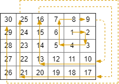

This is [this leetcode problem](https://leetcode.com/problems/spiral-matrix-iii/description/) from [Underdog Devs](https://underdog-devs.slack.com/archives/C02FFHZT200/p1723032739134259)

[Go to tangled solution file](./matrix-spiral-order.kts)

# Problem Statement

You start at the cell `(rStart, cStart)` of an rows x cols grid facing east. The northwest corner is at the first row and column in the grid, and the southeast corner is at the last row and column.

You will walk in a clockwise spiral shape to visit every position in this grid. Whenever you move outside the grid's boundary, we continue our walk outside the grid (but may return to the grid boundary later.). Eventually, we reach all rows \* cols spaces of the grid.

Return an array of coordinates representing the positions of the grid in the order you visited them.

## Example 1:

Input :: `rows = 1, cols = 4, rStart = 0, cStart = 0`
Output :: `[[0,0],[0,1],[0,2],[0,3]]`

## Example 2:

Input :: `rows = 5, cols = 6, rStart = 1, cStart = 4`
Output :: `[[1,4],[1,5],[2,5],[2,4],[2,3],[1,3],[0,3],[0,4],[0,5],[3,5],[3,4],[3,3],[3,2],[2,2],[1,2],[0,2],[4,5],[4,4],[4,3],[4,2],[4,1],[3,1],[2,1],[1,1],[0,1],[4,0],[3,0],[2,0],[1,0],[0,0]]`

## Constraints:

-   `1 <= rows, cols <= 100`
-   `0 <= rStart < rows`
-   `0 <= cStart < cols`

# Brianstorming

This is largely a matter of charting out a spiral. We can do that via an iterable stream.

-   Infinite spiral starting at 0, 0
-   Map translate each by the "start" point
-   Filter for each point being in bounds
-   End after we've yielded the correct number of points

## Can I do this without induction?

I guess a spiral itself is just an equation. I could calculate each position from the previous of course but I wonder if I could derive the formula to do it without induction

    +----+
    |+--+
    ||>+|
    |+-+|
    +---+

<table border="2" cellspacing="0" cellpadding="6" rules="groups" frame="hsides">

<colgroup>
<col  class="org-left" />

<col  class="org-left" />

<col  class="org-right" />
</colgroup>
<thead>
<tr>
<th scope="col" class="org-left">row,col</th>
<th scope="col" class="org-left">direction</th>
<th scope="col" class="org-right">run</th>
</tr>
</thead>

<tbody>
<tr>
<td class="org-left">0,0</td>
<td class="org-left">→</td>
<td class="org-right">1</td>
</tr>

<tr>
<td class="org-left">0,1</td>
<td class="org-left">↓</td>
<td class="org-right">1</td>
</tr>

<tr>
<td class="org-left">1,1</td>
<td class="org-left">←</td>
<td class="org-right">2</td>
</tr>

<tr>
<td class="org-left">1,0</td>
<td class="org-left">←</td>
<td class="org-right">&#xa0;</td>
</tr>

<tr>
<td class="org-left">1,-1</td>
<td class="org-left">↑</td>
<td class="org-right">2</td>
</tr>

<tr>
<td class="org-left">0,-1</td>
<td class="org-left">↑</td>
<td class="org-right">&#xa0;</td>
</tr>

<tr>
<td class="org-left">-1,-1</td>
<td class="org-left">→</td>
<td class="org-right">3</td>
</tr>

<tr>
<td class="org-left">-1,0</td>
<td class="org-left">→</td>
<td class="org-right">&#xa0;</td>
</tr>

<tr>
<td class="org-left">-1,1</td>
<td class="org-left">→</td>
<td class="org-right">&#xa0;</td>
</tr>

<tr>
<td class="org-left">-1,2</td>
<td class="org-left">↓</td>
<td class="org-right">3</td>
</tr>

<tr>
<td class="org-left">0,2</td>
<td class="org-left">↓</td>
<td class="org-right">&#xa0;</td>
</tr>

<tr>
<td class="org-left">1,2</td>
<td class="org-left">↓</td>
<td class="org-right">&#xa0;</td>
</tr>

<tr>
<td class="org-left">2,2</td>
<td class="org-left">←</td>
<td class="org-right">4</td>
</tr>

<tr>
<td class="org-left">2,1</td>
<td class="org-left">←</td>
<td class="org-right">&#xa0;</td>
</tr>

<tr>
<td class="org-left">2,0</td>
<td class="org-left">←</td>
<td class="org-right">&#xa0;</td>
</tr>

<tr>
<td class="org-left">2,-1</td>
<td class="org-left">←</td>
<td class="org-right">&#xa0;</td>
</tr>

<tr>
<td class="org-left">2,-2</td>
<td class="org-left">↑</td>
<td class="org-right">4</td>
</tr>

<tr>
<td class="org-left">1,-2</td>
<td class="org-left">↑</td>
<td class="org-right">&#xa0;</td>
</tr>

<tr>
<td class="org-left">0,-2</td>
<td class="org-left">↑</td>
<td class="org-right">&#xa0;</td>
</tr>

<tr>
<td class="org-left">-1,-2</td>
<td class="org-left">↑</td>
<td class="org-right">&#xa0;</td>
</tr>

<tr>
<td class="org-left">-2,-2</td>
<td class="org-left">→</td>
<td class="org-right">5</td>
</tr>

<tr>
<td class="org-left">-2,-1</td>
<td class="org-left">→</td>
<td class="org-right">&#xa0;</td>
</tr>

<tr>
<td class="org-left">-2,0</td>
<td class="org-left">→</td>
<td class="org-right">&#xa0;</td>
</tr>

<tr>
<td class="org-left">-2,1</td>
<td class="org-left">→</td>
<td class="org-right">&#xa0;</td>
</tr>

<tr>
<td class="org-left">-2,2</td>
<td class="org-left">→</td>
<td class="org-right">&#xa0;</td>
</tr>

<tr>
<td class="org-left">-2,3</td>
<td class="org-left">↓</td>
<td class="org-right">5</td>
</tr>
</tbody>
</table>

-   → on 1, 3, 5, &#x2026;
    -   (0,0) (-1,-1) (-2,-2), &#x2026;
-   ↓ on 1', 3', 5', &#x2026;
    -   (0,1) (-1,2) (-2,3), &#x2026;
-   ← on 2, 4, &#x2026;
    -   (1,1) (2,2)
-   ↑ on 2', 4'
    -   (1,-1) (2,-2)

ok, so I think I can figure out the pattern. Starting with the ordinal numbers:

-   for each `n` in `1..`
    -   when `n` is odd
        -   start at `( (1-n)/2, (1-n)/2 )`
            -   for each `n'` in `0..(n-1)` do `( (1-n)/2, (1-n)/2+n')`
        -   start at `( (1-n)/2+n, (1-n)/2 )`
            -   for each `n'` in `0..(n-1)` do `( (1-n)/2+n, (1-n)/2+n')`
    -   when n is even
        -   start at `(n/2, n/2)`
            -   for each `` n` `` in `0..n` do `(n/2, n/2-n')`
        -   start at `(n/2, n/-2)`
            -   for each `` n` `` in `0..n` do `(n/2-n', n/-2)`

## Not that

That would actually be fun to do it this way, but it seems like it would be more work than tracking state. A generator which just adds row/columns as it goes is **really** straightforward after all.

## Language Choice

What language would I pick? One that has nice iterables I guess. You know, I've been talking to a company that's heavily java lately, and though I can't bring myself to actually do java, I've never done Kotlin and that should be fun

## Install Kotlin

Install with sdkman 

I also need to install [ob-kotlin](https://github.com/zweifisch/ob-kotlin) if I want to work in the org document then `ob-kotlin`

    (1..100).filter {it % 19 == 0}.reduce {a,b -> a + b}

Oh ok, so what do generators look like?

    val infiniteCounter = generateSequence(1) { it + 1 }
    infiniteCounter.take(5).toList()

oh ok, that gives me a good amount to go on

# Implementation

Ok, now just coding it up while having ChatGPT help me with syntax (I'm actually typing everything, not copy-pasting to build up some muscle memory)

    data class Coordinates(val row: Int, val column: Int)
    
    
    fun spiral(): Sequence<Coordinates> = sequence {
        var row = 0
        var col = 0
    
        yield(Coordinates(row, col))
    
        val ordinals = generateSequence(1) { it + 1}
        val sideSizes = ordinals.iterator()
    
        while (true) {
            var sideSize = sideSizes.next()
            // →
            for (n in 0 until sideSize)
                yield(Coordinates(row, ++col))
            // ↓
            for (n in 0 until sideSize)
                yield(Coordinates(++row, col))
    
            var nextSideSize = sideSizes.next()
            // ←
            for (n in 0 until nextSideSize)
                yield(Coordinates(row, --col))
            // ↑
            for (n in 0 until nextSideSize)
                yield(Coordinates(--row, col))
        }
    }

test it

    
    "\n"+spiral().take(15).map{ "[${it.row}, ${it.column}]"}.joinToString("\n")

    res0: kotlin.String =
    [0, 0]
    [0, 1]
    [1, 1]
    [1, 0]
    [1, -1]
    [0, -1]
    [-1, -1]
    [-1, 0]
    [-1, 1]
    [-1, 2]
    [0, 2]
    [1, 2]
    [2, 2]
    [2, 1]
    [2, 0]
    res1: kotlin.String = >>>

Yes, that looks right.

So now we're going to want to do the rest of this. translate and filter, then keep drawing from the sequence until we have all our squares filled

    var spiralCoordinates = spiral().map{ Coordinates(it.row+rStart, it.column+cStart)}
    var onGridSpiral = spiralCoordinates.filter { it.row in 0..(rows-1) && it.column in 0..(columns-1) }
    var gridInSpiralOrder = onGridSpiral.take(rows*columns)

And to view output output, do this

    

    
    
    "\n"+gridInSpiralOrder.map{ "[${it.row}, ${it.column}]"}.joinToString("\n")

Lets see it with values from example 1

    var rows = 1
    var columns = 4
    var rStart = 0
    var cStart = 0

    res0: kotlin.String = 
    [0, 0]
    [0, 1]
    [0, 2]
    [0, 3]
    res1: kotlin.String = >>> 

That's right, what if we started in column 2?

    var rows = 1
    var columns = 4
    var rStart = 0
    var cStart = 2

    res2: kotlin.String = 
    [0, 2]
    [0, 3]
    [0, 1]
    [0, 0]
    res3: kotlin.String = >>> 

Oh that's cool. And the right answer. Lets see it with Example 2

    var rows = 5
    var columns = 6
    var rStart = 1
    var cStart = 4

    res4: kotlin.String = 
    [1, 4]
    [1, 5]
    [2, 5]
    [2, 4]
    [2, 3]
    [1, 3]
    [0, 3]
    [0, 4]
    [0, 5]
    [3, 5]
    [3, 4]
    [3, 3]
    [3, 2]
    [2, 2]
    [1, 2]
    [0, 2]
    [4, 5]
    [4, 4]
    [4, 3]
    [4, 2]
    [4, 1]
    [3, 1]
    [2, 1]
    [1, 1]
    [0, 1]
    [4, 0]
    [3, 0]
    [2, 0]
    [1, 0]
    [0, 0]
    res5: kotlin.String = >>> 

Why yes. That's the exactly same answer!

